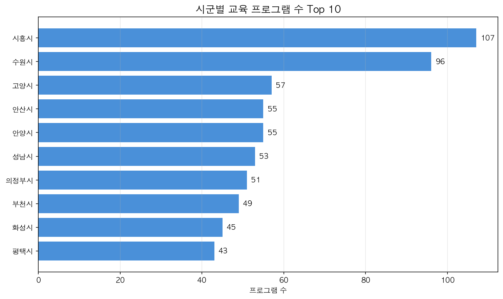
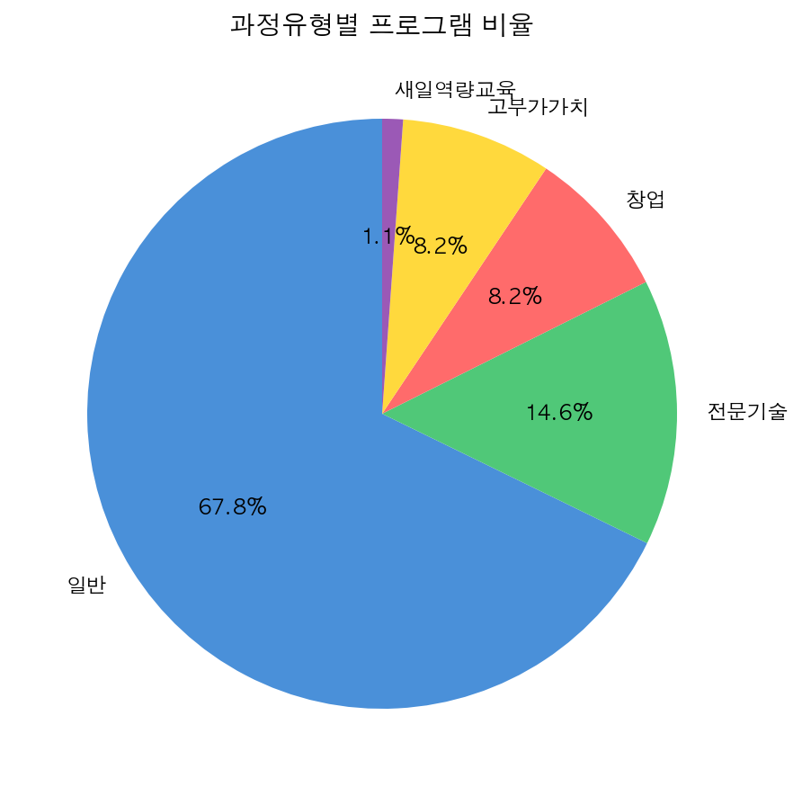
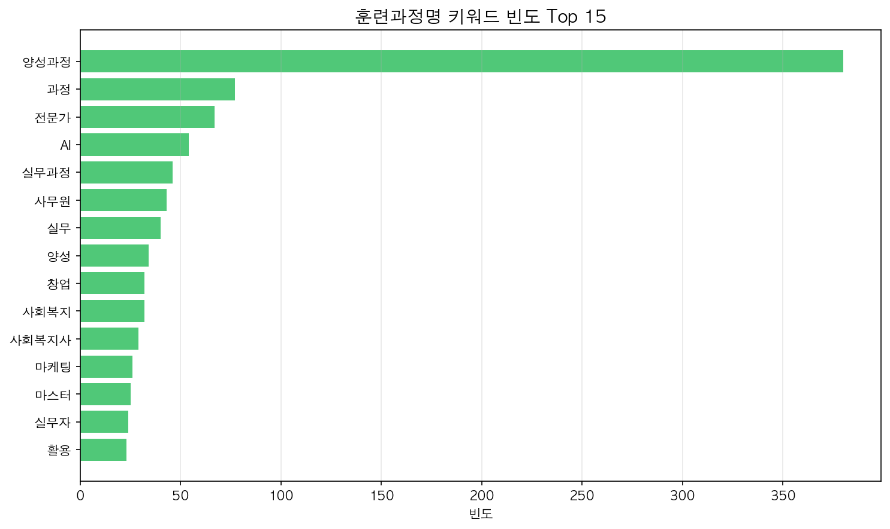

# 🏷 경기도 경력단절여성 직업교육훈련 현황 분석

> 2018년부터 2025년까지의 경기도 경력단절여성 직업교육훈련 데이터를 바탕으로 지역별, 유형별, 연도별 트렌드를 분석하여 앞으로의 방향성을 도출합니다.



---

## 🛠 사용 기술

`Python` `pandas` `Matplotlib` `seaborn`

## 🔑 핵심 인사이트 3줄 요약

- 💡 **시흥시, 수원시** 등 산업 수요가 많은 지역을 중심으로 교육 프로그램이 매우 활발히 운영되고 있습니다.
- 💡 전체 과정의 약 65%가 **'일반'** 유형에 집중되어 있어 전통적 직군에 대한 교육 비중이 여전히 큽니다.
- 💡 교육 과정 트렌드에서는 **'AI', '전문가', '실무과정'** 등 디지털 역량과 실무 중심의 키워드가 강세를 보이며 진화하고 있습니다.

## 🔗 링크

- 📓 [데이터 분석 코드 보러가기](#)
- 🐙 [GitHub 레포지토리](#)

---

## 1️⃣ 문제 정의 & 기대효과

### 왜 이 분석을 시작했나요?

경력단절여성의 원활한 재취업을 돕기 위해 현재 어떤 지역에서 어떤 유형의 직업 훈련이 제공되고 있는지 객관적인 현황을 파악하는 것은 매우 중요합니다. 교육 과정의 트렌드를 분석하여 실질적으로 도움이 되는 교육 인사이트를 도출하고자 했습니다.

### 이걸 해결하면 뭐가 좋아지나요?

현행 교육 프로그램이 특정 분야('일반' 과정 등)에 과도하게 편중되어 있는지 확인하고, 4차 산업혁명 등 최신 트렌드('AI', '전문기술' 등)에 맞는 고부가가치 훈련 과정 기획을 위한 정책적·비즈니스적 제안을 도출할 수 있습니다.

---

## 2️⃣ 데이터 요약

| 항목        | 내용                                       |
| ----------- | ------------------------------------------ |
| 데이터 기간 | 2018년 ~ 2025년                            |
| 행/열 수    | 1,101행 × 약 20열                           |
| 주요 컬럼   | `시군명`, `과정유형`, `훈련과정명`, `교육시작일` |

---

## 3️⃣ 분석 프로세스

```text
[데이터 수집] → [EDA 및 결측치 정제] → [지역별/유형별 분석] → [연도별 트렌드 분석] → [키워드 도출]
    ↓             ↓                 ↓                ↓             ↓
  CSV로드      결측치 처리 / 전처리   groupby/bar      lineplot       텍스트분석
```

---

## 4️⃣ 분석 내용

### 📊 분석 1: 시군별 교육 프로그램 현황


**👉 발견한 것**:  
시흥시(107개)와 수원시(96개)가 가장 많은 교육 프로그램을 운영하고 있으며, 고양시, 안산시, 안양시가 그 뒤를 잇습니다.

**🔍 왜 그럴까?**:  
시흥과 수원 등은 인구 밀집 지역이자 주요 산업 단지가 위치해 있어, 여성 인력에 대한 일자리 수요와 공급이 모두 활발하게 이루어지고 있기 때문으로 해석됩니다.

---

### 📊 분석 2: 과정유형별 비율 분포



**👉 발견한 것**:  
대부분의 교육이 '일반' 유형(64.9%)에 치중되어 있으며, '전문기술'(14.0%), '창업'(7.9%), '고부가가치'(7.9%) 순으로 나타납니다.

**🔍 왜 그럴까?**:  
사무원, 요양보호사 등 전통적으로 수요가 꾸준하고 진입장벽이 비교적 낮은 직종 위주의 일반 교육이 아직까지 뼈대를 이루고 있음을 시사합니다.

---

### 📊 분석 3: 훈련과정명 키워드 분석



**👉 발견한 것**:  
과정명에서 '전문가'(67회), 'AI'(54회), '실무과정'(46회), '사무원'(43회), '마케팅', '크리에이터' 등의 트렌디한 키워드가 많이 등장합니다.

**🔍 왜 그럴까?**:  
단순 보조 인력을 넘어 즉시 투입 가능한 '전문가' 수준의 실무 역량을 요구하는 시장 변화를 반영하고 있으며, AI 및 디지털 마케팅 등 기술 융합형 교육으로 진화하고 있음을 알 수 있습니다.

---

## 5️⃣ 결론 & 전략적 제안

### 🎯 결론

경력단절여성을 위한 직업교육훈련은 지역별로 활발히 운영되고 있으나, 교육 유형이 '일반' 과정에 65% 이상 편중되어 있어 4차 산업혁명 시대에 걸맞은 질적 고도화가 필요한 시점입니다.

### 💼 전략적 제안 (Action Items)

1. **지역 맞춤형 교육 고도화**: 수원, 성남 등 IT 인프라가 강한 지역은 '고부가가치' 및 '전문기술' 비중을 선제적으로 확대해야 합니다.
2. **디지털 융합 과정 개편**: 키워드 분석에서 'AI', '크리에이터' 수요가 확인된 만큼, 기존 일반 사무원 과정을 넘어 'AI 활용 스마트 사무원' 등 융합형 과정으로 개편할 필요가 있습니다.
3. **고부가가치 집중 투자**: '일반' 유형에 집중된 비율을 점진적으로 낮추고, 향후 취업의 질과 급여 수준이 높은 '장기고부가가치' 교육 쪽으로 자원을 재분배해야 합니다.

---

## 6️⃣ Lesson & Learned

### 🛠 기술적으로 배운 것

- 한글 폰트가 깨지지 않도록 동적으로 환경을 설정하고 시각화하는 방법
- pandas를 활용하여 지저분한 범주형 데이터를 하나의 기준으로 묶고 정제하는(Cleansing) 데이터 핸들링 기법

### 💡 분석가로서 배운 것

- 단순히 "일반 과정이 제일 많다"로 끝내지 않고, 최근 키워드(AI, 전문가)와 연결하여 **"앞으로 어떤 교육 과정으로 발전해야 하는지"에 대한 정책적/비즈니스적 제안을 도출**하는 사고방식을 길렀습니다.

---

#데이터분석 #포트폴리오 #경력단절여성 #직업교육 #pandas #시각화
