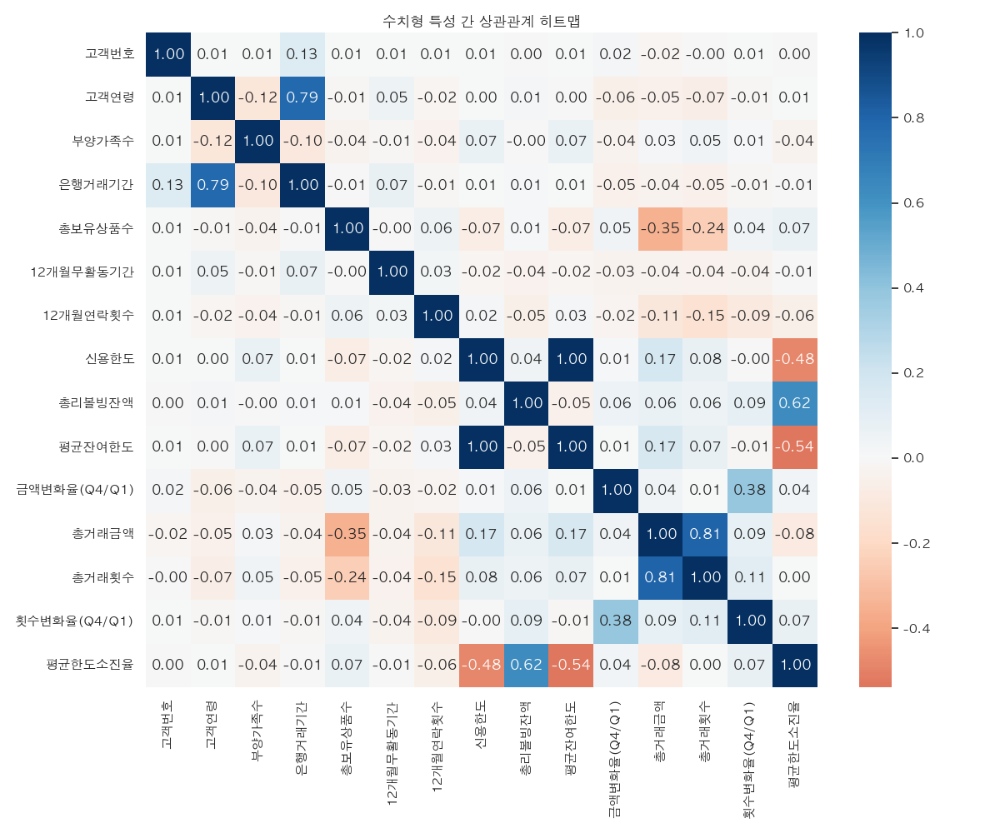
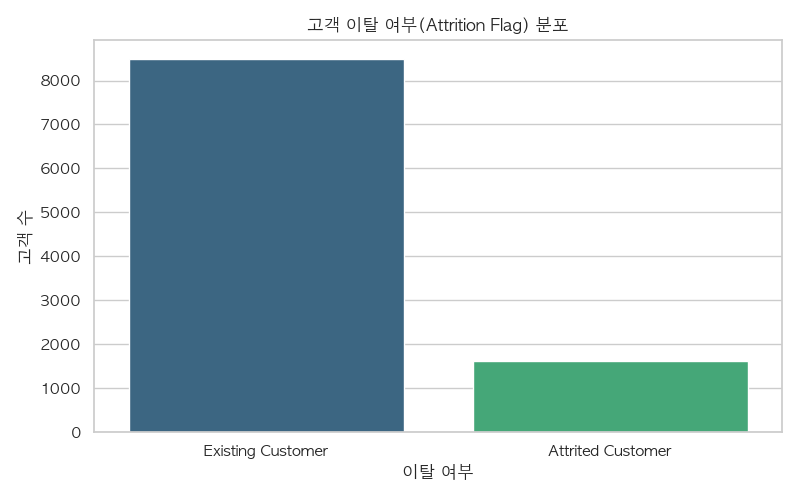
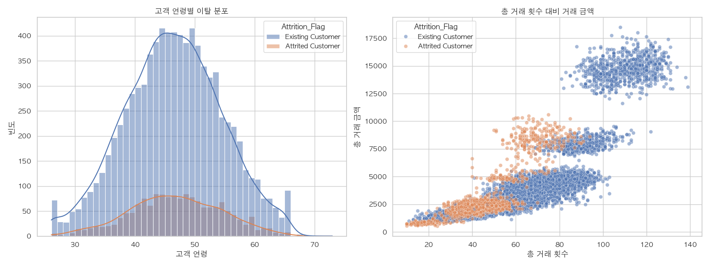

# 🏷 신용카드 이탈 고객 분석 - 어떤 고객이 떠나는가?

> 1만여 명의 신용카드 고객 데이터를 통해 이탈 고객의 특성과 행동 패턴을 분석하여 비즈니스 개선 인사이트를 도출합니다.



---

## 🛠 사용 기술

`Python` `pandas` `Matplotlib` `seaborn`

## 🔑 핵심 인사이트 3줄 요약

- 💡 전체 고객의 약 16%가 이탈 고객이며, 나머지 84%가 유지 고객으로 확인되었습니다.
- 💡 연령대 분포를 보면 40~50대에 고객이 밀집되어 있어, 해당 연령층의 이탈 관리가 비즈니스에 매우 중요합니다.
- 💡 이탈 고객은 뚜렷하게 '총 거래 횟수'와 '거래 금액'이 낮은 구역에 분포하여, 활동성 저하가 이탈의 주요 전조 증상임을 알 수 있습니다.

## 🔗 링크

- 📓 [코랩 노트북 보기](https://colab.research.google.com/drive/17QBzI6871R2Jx2iLbNW-il8XoxTYd6qT?usp=drive_link)
- 🐙 [GitHub 레포지토리](#)

---

## 1️⃣ 문제 정의 & 기대효과

### 왜 이 분석을 시작했나요?

신용카드사에서 고객 유지는 신규 고객 유치보다 비용 효율적입니다. 어떤 특징을 가진 고객이 이탈하는지(Attrition) 명확히 파악하여 선제적으로 대응하기 위해 분석을 시작했습니다.

### 이걸 해결하면 뭐가 좋아지나요?

고객 이탈의 전조 증상(거래 횟수 하락 등)을 미리 파악하고 세그먼트별 맞춤 리텐션 프로모션을 제공함으로써 이탈률을 낮추고 장기적인 수익을 개선할 수 있습니다.

---

## 2️⃣ 데이터 요약

| 항목        | 내용                                       |
| ----------- | ------------------------------------------ |
| 데이터 출처 | BankChurners.csv                           |
| 데이터 기간 | 특정 기준 기간                             |
| 행/열 수    | 10,127행 × 21열                            |
| 주요 컬럼   | `Attrition_Flag`(이탈여부), `Customer_Age`(고객연령), `Total_Trans_Ct`(총거래횟수), `Total_Trans_Amt`(총거래금액) |

---

## 3️⃣ 분석 프로세스

```text
[데이터 수집] → [EDA 및 결측치 확인] → [변수간 상관관계] → [타겟변수 비교] → [인사이트]
    ↓             ↓                 ↓                ↓             ↓
  read_csv     isnull/describe    heatmap          countplot      전략 제안
```

---

## 4️⃣ 주요 수행 역할

- ✅ **데이터 전처리**: 10,127개의 데이터셋의 결측치 유무 확인 및 요약 통계량 점검
- ✅ **EDA**: 고객 이탈 여부 비율(84% vs 16%) 및 성별/소득수준별 분포 확인
- ✅ **상관관계 분석**: 15개의 수치형 변수 간의 히트맵 시각화를 통한 다중공선성 및 특성 연관성 파악
- ✅ **시각화 & 인사이트**: 이탈 고객의 연령대 분포 및 총 거래 횟수/금액 산점도를 통해 이탈 임계값 가설 수립

---

## 5️⃣ 분석 내용

### 📊 분석 1: 타겟 변수(고객 이탈 여부) 분포



**👉 발견한 것**:  
전체 1만 여 명의 고객 중 이탈 고객(Attrited Customer)은 약 16%를 차지하며, 유지 고객은 84%로 나타났습니다.

**🔍 왜 그럴까?**:  
일반적인 서비스의 자연 이탈률 범주에 속할 수 있으나, 이 16%가 발생시키는 매출 기회비용을 줄이기 위해 집중 관리가 필요합니다.

---

### 📊 분석 2: 수치형 변수 간 상관관계 (히트맵)


**👉 발견한 것**:  
총 거래 횟수(`Total_Trans_Ct`)와 신용한도소진율(`Avg_Utilization_Ratio`) 등 여러 지표 간의 상관관계를 파악했습니다.

**🔍 왜 그럴까?**:  
일부 변수들 간의 강한 상관관계는 고객의 카드 사용 패턴(예: 한도 대비 실제 사용량)을 대변하므로 모델링 시 중요한 파생 변수로 활용될 수 있습니다.

---

### 📊 분석 3: 고객 연령 및 이용 행태와 이탈 관계



**👉 발견한 것**:  
이탈 고객은 총 거래 횟수 40회 이하, 거래 금액이 낮은 구간에 명확하게 몰려 있는 반면, 거래 횟수가 80회 이상인 고객 중에서는 이탈이 거의 발생하지 않았습니다.

**🔍 왜 그럴까?**:  
결국 카드를 '자주, 많이' 쓰는 고객은 락인(Lock-in) 효과가 강력하며, 거래 빈도가 급격히 떨어지는 것이 이탈의 가장 확실한 시그널임을 의미합니다.

---

## 6️⃣ 결론 & 전략적 제안

### 🎯 결론

이탈 고객은 연령적으로 40~50대 비중이 높고, 행동 데이터 측면에서 '거래 횟수와 금액'이 뚜렷하게 낮은 특징을 가집니다. 따라서 카드 사용 빈도가 줄어드는 시점을 캐치하는 것이 핵심입니다.

### 💼 전략적 제안 (Action Items)

1. **조기 경보 시스템 도입**: 월별 거래 횟수가 이전 3개월 평균 대비 30% 이상 급감하는 고객을 자동 추출하여 선제적 알림 제공
2. **리인게이지먼트 프로모션**: 거래 횟수 20~40회 구간의 4050 고객을 대상으로, 생활 밀착형(마트, 주유소 등) 혜택 쿠폰 발송
3. **VIP 락인 전략 강화**: 거래 횟수 80회 이상인 충성 고객에게는 등급 상향 및 프리미엄 서비스 제공으로 이탈 원천 차단

### 📈 기대효과

- **매출 측면**: 이탈 위험군 방어를 통한 LTV(고객 생애 가치) 감소 방지 및 매출 하락 방어
- **고객 측면**: 맞춤형 혜택 제공으로 고객의 불만 해소 및 카드 사용 만족도 증가

---

## 7️⃣ Lesson & Learned

### 🛠 기술적으로 배운 것

- 한글 폰트 적용 및 Seaborn을 활용한 다양한 시각화 기법(히트맵, 산점도 혼합 등)의 숙달
- 데이터 내 수치형 변수만 추출하여 다차원 상관관계를 한 눈에 파악하는 방법론 습득

### 💡 분석가로서 배운 것

- EDA 과정에서 가설(거래 횟수가 적은 사람이 이탈할 것이다)을 데이터를 통해 직관적인 산점도로 증명해내는 경험
- 결과를 단순히 보여주는 것에 그치지 않고, 비즈니스 부서가 바로 실행할 수 있는 액션 아이템으로 번역하는 사고방식

### 🚀 다음에 더 해보고 싶은 것

- 머신러닝 분류 모델(Random Forest, XGBoost 등)을 도입하여 이탈 여부를 직접 예측하는 모델 구축
- Feature Importance를 뽑아내어 시각적 추론을 정량적 수치로 교차 검증하기

---

## 📚 참고 자료

- [데이터 출처 (Kaggle/GitHub 등)](#)
- 제공된 코랩 노트북

---

#데이터분석 #포트폴리오 #pandas #Python #고객이탈분석 #시각화
