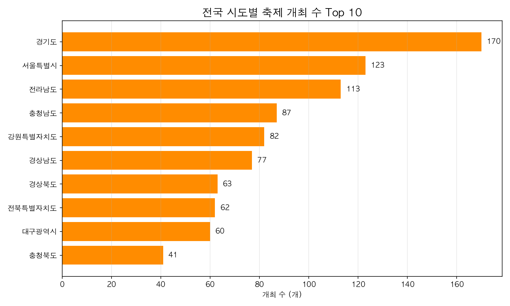
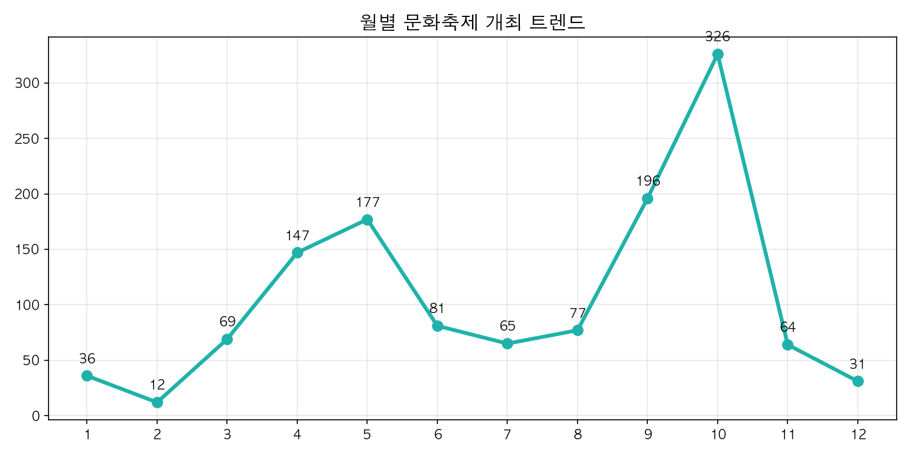
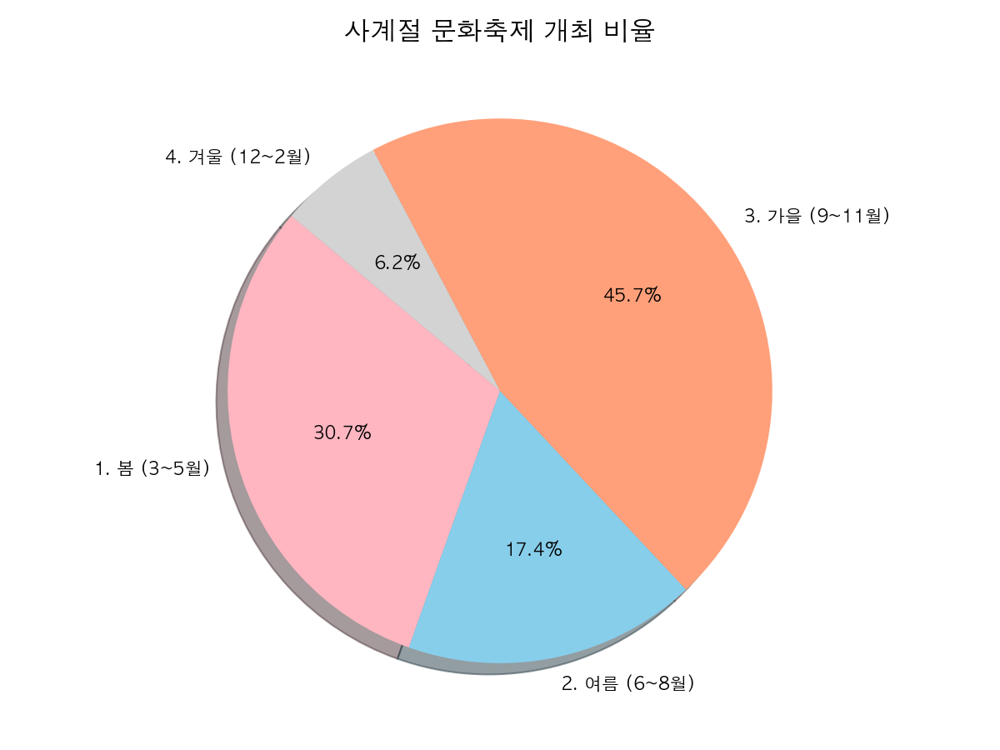
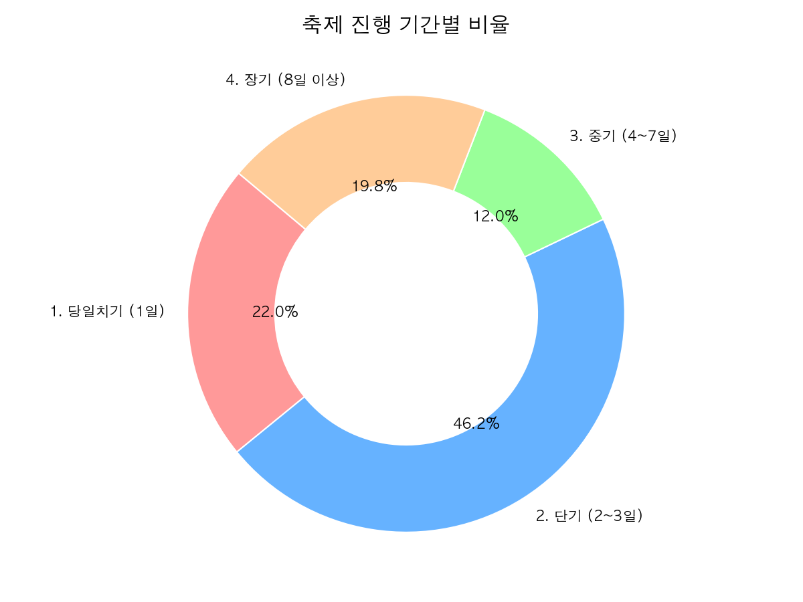
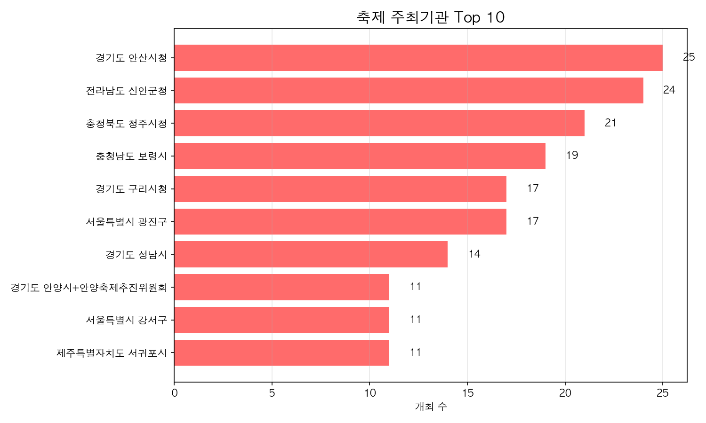

# 🎪 전국 문화축제 표준데이터 EDA 분석

이번 프로젝트는 공공데이터포털의 **전국문화축제표준데이터 Open API**를 활용하여, 전국에서 열리는 다양한 축제들의 현황을 데이터 분석(EDA) 워크플로우에 따라 파헤쳐 본 결과입니다.

---

## 1. 프로젝트 개요

- **데이터 출처**: 공공데이터포털 (전국문화축제표준데이터 API)
- **수집 방법**: `requests` 라이브러리를 활용한 JSON 응답 수집 (페이지네이션 처리)
- **분석 도구**: Python (Pandas, Matplotlib)
- **분석 목표**: 
  - 지역별 축제 개최 현황 파악
  - 월별/계절별 축제 개최 트렌드 파악
  - 평균적인 축제 진행 기간(단기/장기) 분포 확인

---

## 2. 지역별 축제 개최 현황 (Top 10)

어느 지역에서 축제가 가장 많이 열릴까요? 전국에서 가장 축제를 많이 개최하는 상위 10개 시/도를 분석해 보았습니다.

> **인사이트 💡**
> 경기도, 전라남도, 강원특별자치도 등에서 가장 많은 수의 축제가 개최되고 있습니다. 각 지자체의 적극적인 관광 유치 활동과 풍부한 지역 자원을 바탕으로 한 결과로 보입니다.

---

## 3. 축제의 계절 트렌드 분석

1년 중 축제는 언제 가장 붐빌까요? 월별 개최 추이와 사계절 비중을 분석했습니다.

### 월별 축제 개최 트렌드

> **인사이트 💡**
> 야외 활동이 기지개를 켜는 5월(봄)과, 수확의 기쁨을 나누며 날씨가 선선해지는 10월(가을)에 축제가 가장 압도적으로 많이 열리는 양상을 보입니다.

### 사계절 축제 비율

> **인사이트 💡**
> 전체 축제 중 가을(9~11월)과 봄(3~5월)에 개최되는 비율이 절반 이상을 차지합니다. 특히 겨울철은 날씨의 영향으로 축제 비중이 가장 낮게 나타났습니다.

---

## 4. 축제 진행 기간 (얼마나 길게 할까?)

축제는 보통 며칠 동안 열리는 것이 대세일까요?

> **인사이트 💡**
> 대부분의 문화축제는 **2~3일 내외의 '단기' 일정**으로 기획됩니다. 이는 주말을 낀 여행객들의 일정(금~일)에 맞춰 집중적으로 행사를 진행하는 것이 가장 효과적이기 때문으로 분석됩니다. 

---

## 5. 주최기관 Top 10

마지막으로 축제를 가장 많이 주최하는 기관은 어디인지 살펴보았습니다.

> **인사이트 💡**
> 기초자치단체(군청/시청)가 지역 경제 활성화와 관광객 유치를 위해 직접 축제를 기획하고 주최하는 경우가 가장 많습니다.

---

## 📊 결론 및 요약

공공데이터포털 API를 활용하여 대한민국의 문화축제 트렌드를 분석한 결과, 아래와 같은 핵심 비즈니스 인사이트를 도출할 수 있었습니다.

1. **지역 집중도**: 경기도, 전남, 강원 등 일부 지역이 축제 개최를 선도하고 있습니다.
2. **명확한 계절성**: 축제는 5월과 10월에 극도로 집중되며, 전반적으로 가을에 가장 많은 행사가 기획됩니다.
3. **단기 집객 전략**: 우리나라 축제의 대다수는 방문객의 주말 일정에 맞춘 **'2~3일'의 단기 행사**로 운영되어 단기간에 화제성과 관광객을 집중시키는 전략을 취하고 있습니다.

위 분석은 파이썬과 Pandas를 이용해 데이터를 수집하고 정제하는 과정을 거쳐 도출되었습니다. 앞으로도 다양한 공공데이터를 통해 우리 사회의 흥미로운 트렌드를 계속해서 분석해 나갈 예정입니다!
