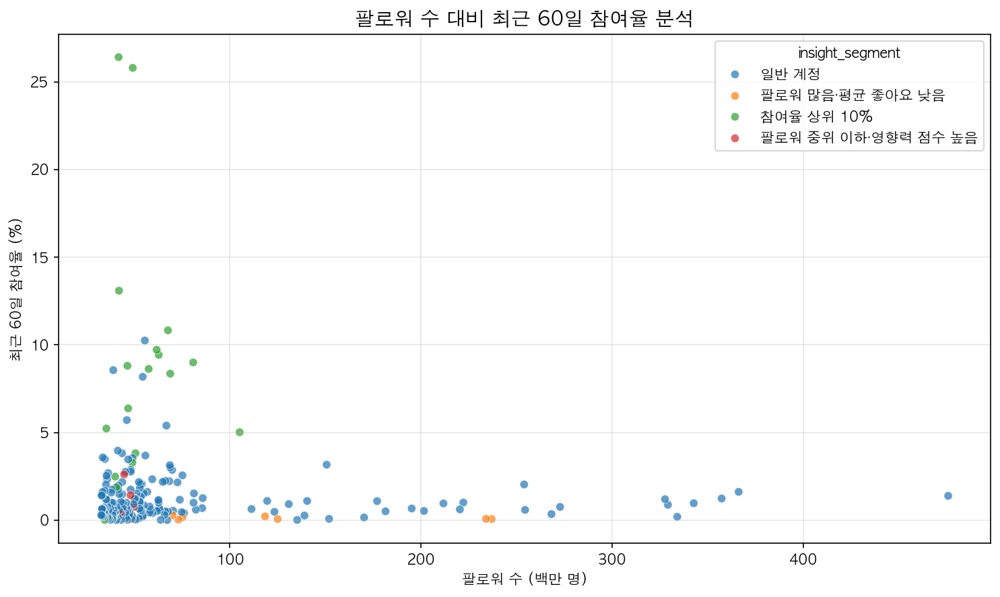
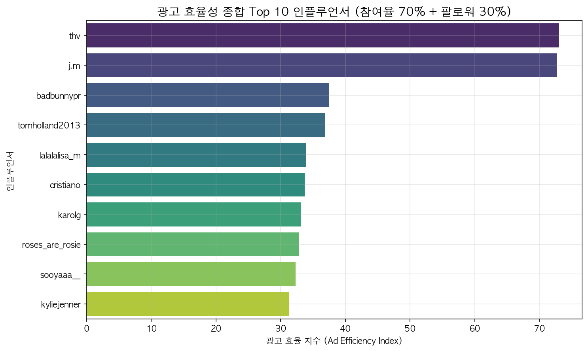

# 🏷 인스타그램 인플루언서 광고 효율성 분석

> 인스타그램 인플루언서의 실제 참여율과 팔로워 데이터를 결합해 진짜 광고 효율이 높은 '숨은 진주'를 찾다



---

## 🛠 사용 기술

`Python` `pandas` `Matplotlib` `Seaborn`

## 🔑 핵심 인사이트 3줄 요약

- 💡 팔로워 수가 절대적인 참여율을 보장하지 않으며, 특정 인사이트 그룹에서 더 높은 활성도를 보임.
- 💡 최근 60일 참여율(70%)과 팔로워 점수(30%)를 종합한 '광고 효율 지수' 도출.
- 💡 단순 메가 인플루언서가 아닌, 마이크로/매크로 구간의 고효율 Top 10 채널 발굴 완료.

## 🔗 링크

- 🐙 [GitHub 레포지토리](https://github.com/ryujooh)

---

## 1️⃣ 문제 정의 & 기대효과

### 왜 이 분석을 시작했나요?

인플루언서 마케팅 시 단순 팔로워 수만 보고 예산을 집행할 경우 비용 대비 실제 도달/참여 효과가 떨어지는 문제를 확인했습니다. 

### 이걸 해결하면 뭐가 좋아지나요?

허수 팔로워가 아닌 최근 참여율을 기반으로 광고 효율이 가장 높은 채널을 필터링하여, 마케팅 비용을 효율화하고 캠페인 전환율을 극대화할 수 있습니다.

---

## 2️⃣ 데이터 요약

| 항목        | 내용                                       |
| ----------- | ------------------------------------------ |
| 데이터 출처 | 인스타그램 인플루언서 자체 수집 데이터       |
| 주요 지표   | 팔로워 수, 최근 60일 참여율 등             |
| 정제 여부   | 참여율 결측치 제외 등 전처리 완료          |
| 주요 산출물 | 광고 효율 지수 (Ad Efficiency Index)       |

---

## 3️⃣ 분석 프로세스

```text
[데이터 로드] → [결측치/이상치 정제] → [지수 산출] → [그룹별 EDA] → [시각화 & 인사이트]
    ↓                 ↓               ↓               ↓                ↓
 pandas          dropna/조건검색    가중치 계산     groupby/mean     matplotlib/seaborn
```

---

## 4️⃣ 주요 수행 역할

- ✅ **데이터 전처리**: 최근 참여율 결측치 행 제거 및 타입 안정화
- ✅ **Feature Engineering**: 최근 참여율 70% + 팔로워 수 30% 비중의 `Ad_Efficiency_Index` 산출
- ✅ **분석/모델링**: 인사이트 그룹별 평균 참여율 집계
- ✅ **시각화 & 인사이트**: 팔로워 수 대비 참여율 분포 및 광고 효율 Top 10 시각화

---

## 5️⃣ 분석 내용

### 📊 분석 1: 팔로워 수 대비 최근 60일 참여율 분석


**👉 발견한 것**:  
팔로워 수가 증가한다고 해서 최근 60일 참여율이 정비례하여 오르지 않았습니다. 오히려 특정 인사이트 그룹과 팔로워 규모(마이크로~매크로)에서 참여율 밀집도가 높은 구간이 발견되었습니다.

**🔍 왜 그럴까?**:  
초대형 인플루언서의 경우 도달 범위는 넓으나 코어 팬덤의 밀집도가 낮을 수 있습니다. 반면 뾰족한 콘텐츠를 다루는 세그먼트는 진성 팔로워 비중이 높아 반응률이 뛰어나게 나타납니다.

---

### 📊 분석 2: 광고 효율성 종합 Top 10 인플루언서



**👉 발견한 것**:  
단순 팔로워 랭킹과 달리, '참여율(70)+팔로워(30)' 지수 기준으로 정렬한 결과 완전히 새로운 양상의 Top 10 채널 목록이 추출되었습니다. 

**🔍 왜 그럴까?**:  
알고리즘 변화와 피드 노출 방식의 다변화로, 예전처럼 팔로워 숫자 자체보다는 최근 게시물의 실제 유저 반응(Like, Comment 등)이 더 강력한 무기가 되었기 때문입니다.

---

## 6️⃣ 결론 & 전략적 제안

### 🎯 결론

인플루언서 마케팅 예산 편성 시 **단순 팔로워 수가 아닌 '최근 60일 참여율' 중심의 지표를 최우선으로 고려**해야 합니다.

### 💼 전략적 제안 (Action Items)

1. **마이크로 타겟팅**: 메가 인플루언서 1명에게 예산을 올인하는 대신, 발견된 Top 10 고효율 채널 3~4곳에 분산 집행.
2. **성과 모니터링 체계 도입**: 캠페인 진행 후 Ad Efficiency Index 대비 실제 전환율을 비교해 지수 가중치(현재 7:3)를 지속 최적화.

### 📈 기대효과

- **비용 측면**: 허수 계정에 지출되는 불필요한 마케팅 비용 최소화 (예상 20~30% 절감)
- **성과 측면**: 유저의 활발한 인터랙션에 기반하므로 캠페인 체류 시간 및 클릭 전환율 동반 상승 기대

---

## 7️⃣ Lesson & Learned

### 🛠 기술적으로 배운 것

- Pandas 조건부 마스킹을 활용한 결측치 제어 및 타입 예외 처리 능력 향상.
- 가중치를 부여한 파생 변수를 새롭게 정의하여 데이터의 해석력을 높이는 방법.

### 💡 분석가로서 배운 것

- 단순히 데이터를 보여주는 것에 그치지 않고, "어떤 지표가 비즈니스에 더 중요한가(예: 팔로워 vs 최근 참여율)"를 정의하는 주도적인 의사결정이 필요함을 체감했습니다.

---

#데이터분석 #포트폴리오 #pandas #Python #인플루언서 #마케팅효율
