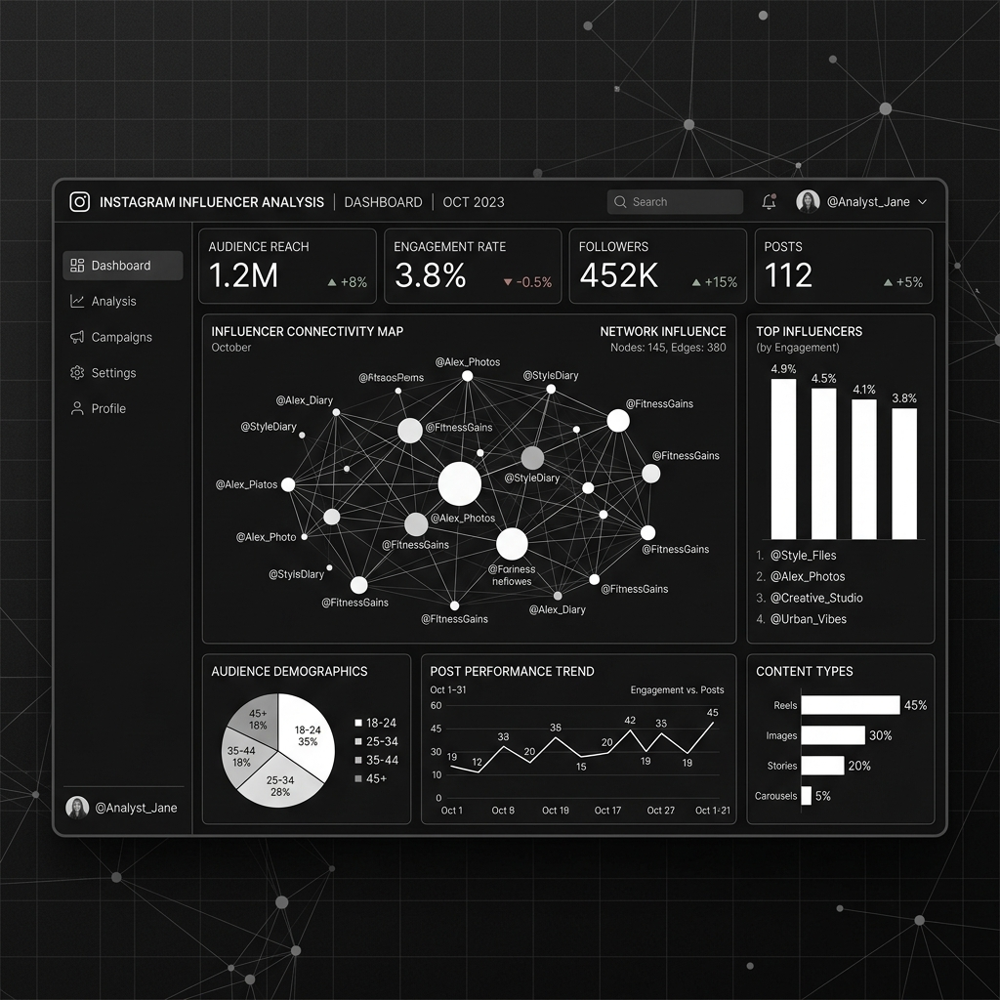

# 인스타그램 인플루언서 분석 I

본 프로젝트는 인스타그램 생태계 내 인플루언서들의 영향력을 데이터로 검증하기 위해 기획되었습니다.

## 주요 분석 내용
- **팔로워 도달 범위**: 인플루언서 규모별 실제 콘텐츠 도달률 측정
- **참여율 지표**: 좋아요, 댓글 데이터를 바탕으로 한 진성 유저 참여 분석
- **콘텐츠 효율**: 어떤 유형의 포스트가 가장 높은 반응을 이끌어내는지 시각화

### 데이터 시각화 확인
상세 데이터와 대시보드는 아래 링크에서 직접 확인하실 수 있습니다.

[👉 Tableau 대시보드 바로가기](https://public.tableau.com/views/_17781236667990/sheet11)
