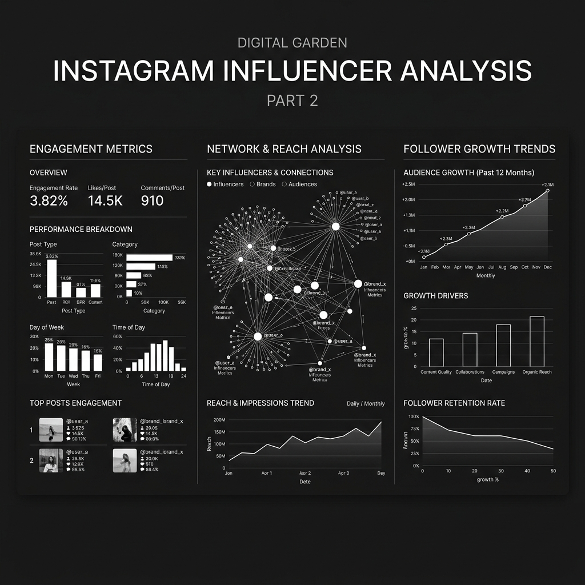

# 인스타그램 인플루언서 분석 II

첫 번째 분석에 이어, 인플루언서들 사이의 네트워크 구조와 팔로워 성장 패턴을 심층 분석했습니다.

## 주요 분석 내용
- **네트워크 연결망**: 인플루언서 간의 상호작용 및 연결 고리 시각화
- **성장 트렌드**: 시간에 따른 팔로워 수의 증감 패턴 및 급상승 요인 분석
- **영향력 전파**: 콘텐츠가 네트워크를 통해 확산되는 경로 추적

### 데이터 시각화 확인
상세 데이터와 대시보드는 아래 링크에서 직접 확인하실 수 있습니다.

[👉 Tableau 대시보드 바로가기](https://public.tableau.com/views/2_17781237796380/2)
