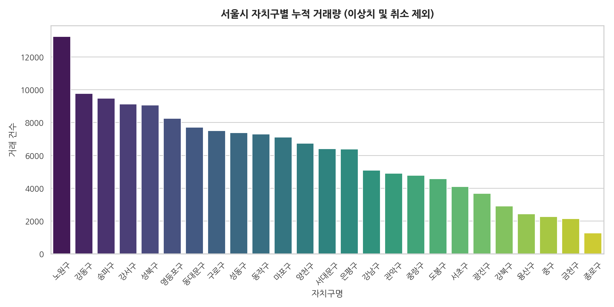
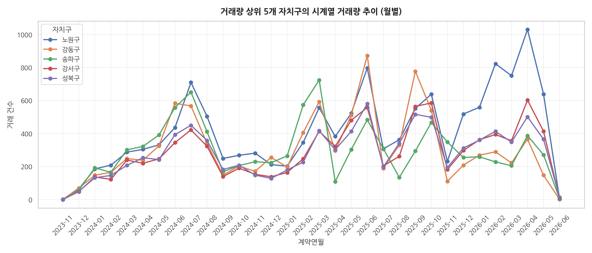
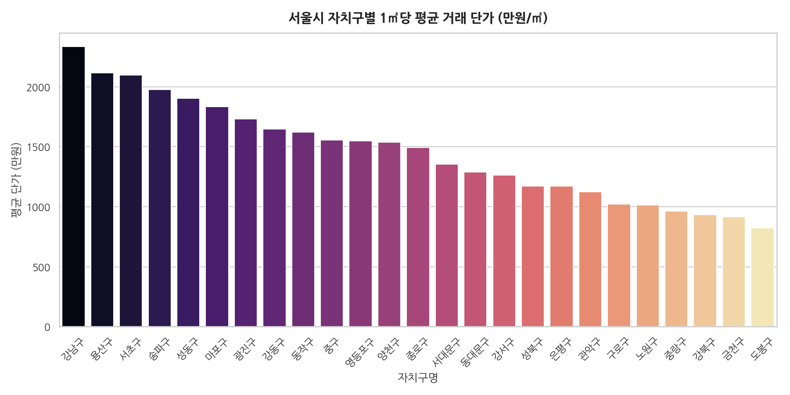
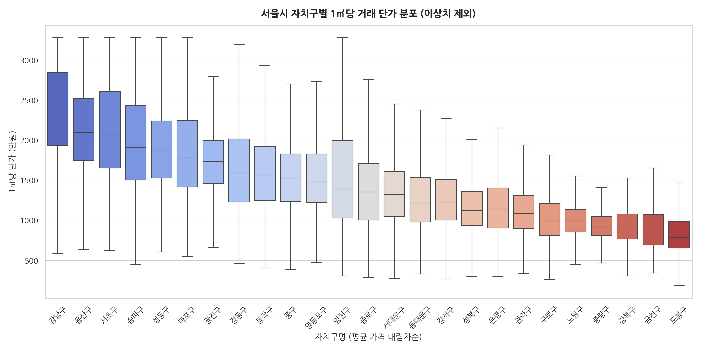
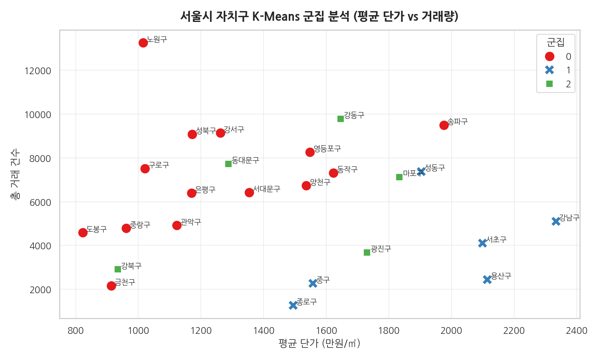
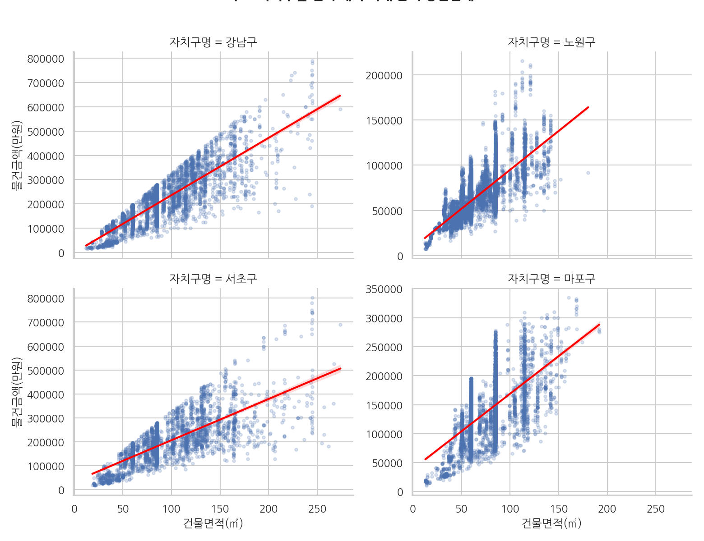
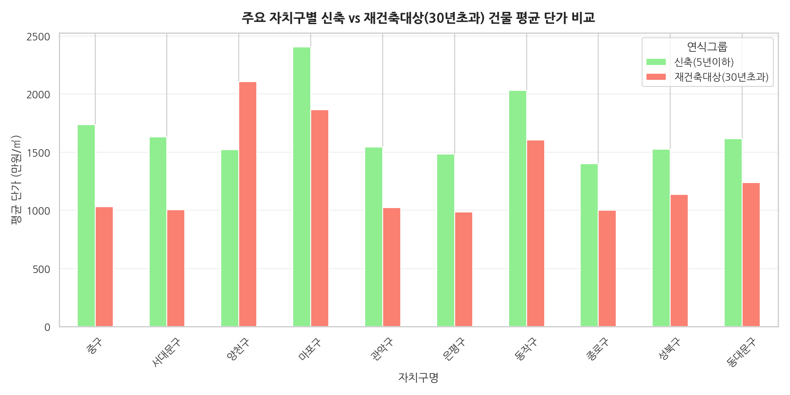
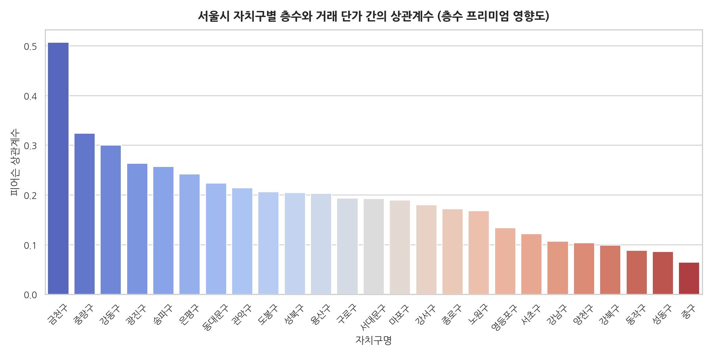
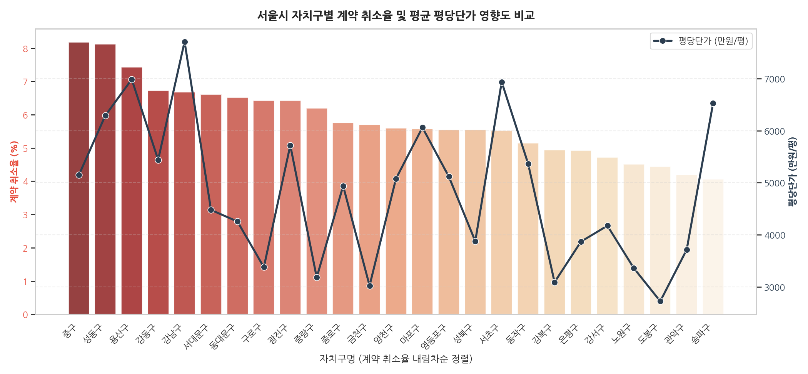
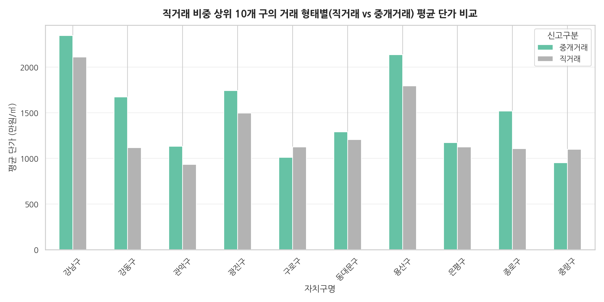

# 🏢 서울시 아파트 실거래가 탐색적 데이터 분석 (EDA) - 자치구 중심 분석

본 프로젝트는 서울시 아파트 실거래가 데이터를 바탕으로 사전 데이터 전처리를 거쳐, 자치구별 시장 동향, 가격 수준 및 양극화 현상, 물리적 요인과 가격의 교차 분석, 그리고 계약 취소 및 직거래 등의 특이사항 분포를 입체적으로 분석한 결과 리포트입니다.

---

## 🛠️ 사전 준비: 데이터 전처리 (Data Preprocessing)

본격적인 자치구별 분석에 앞서 신뢰할 수 있는 인사이트 도출을 위해 데이터를 가공 및 정제하였습니다.

1. **아파트 데이터 대상 필터링**: 주 분석 대상인 **아파트** 실거래 계약 건에 초점을 맞추어 데이터를 필터링하였습니다.
2. **유효 거래 필터링**: '취소일'이 존재하는 행(Row)을 제외하여 실제 계약이 완료된 거래 데이터만 추출하였습니다. (단, 계약 취소율 분석 시에는 전체 계약 건수를 분모로 활용)
3. **파생 변수(Derived Variable) 생성**:
   - 면적의 차이로 인한 가격 왜곡을 차단하기 위해, 총 물건금액을 건물면적으로 나눈 **'1제곱미터(㎡)당 단가'**를 계산하였습니다.
   - '건축년도'와 거래 접수연도를 비교하여 **'건물 연식'** 데이터를 도출하였습니다.
   - '계약일' 데이터를 날짜형으로 변환하여 **'계약년', '계약월', '계약분기'** 등의 시간축 변수로 세분화하였습니다.
4. **이상치 정제**: 극단적인 고가/저가 특수 거래가 전체 통계를 왜곡하는 것을 방지하기 위해, IQR(Interquartile Range) 기준에 맞춰 1㎡당 단가의 이상치를 필터링하였습니다.

---

## 📊 시나리오 A. 자치구별 시장 동향 및 거래량 분석
> **질문**: 서울시 25개 자치구 중 아파트 거래가 활발한 지역은 어디이며, 시간에 따라 거래량은 어떤 흐름을 보이는가?

### ① 자치구별 누적 거래량 비교
전체 기간 동안 어느 구에서 가장 거래가 활발하게 일어났는지 아파트 누적 거래 건수를 비교하였습니다.

> **인사이트 💡**
> 서울시 25개 자치구 중 **노원구(13,257건)**가 가장 많은 누적 거래량을 기록했습니다. 노원구는 대단지 아파트가 밀집해 있고 실수요층의 유입이 꾸준한 지역적 특성이 반영된 결과입니다. 이어서 송파구, 강남구 순으로 거래가 활발하게 나타났습니다.

---

### ② 자치구별 시계열 거래량 추이 (월별)
누적 거래량 상위 5개 자치구를 중심으로 거래량 흐름이 시간의 변화에 따라 어떻게 달라지는지 분석했습니다.

> **인사이트 💡**
> 시계열 트렌드 확인 결과, 특정 시기(예: 부동산 대책 발표 전후나 연말연시 비수기 등)에 모든 자치구의 거래량이 동조화되어 급감하거나 급증하는 양상이 확인됩니다. 특히 거래 규모가 큰 노원구와 송파구의 거래 동향이 전체 시계열 변동폭을 주도하고 있습니다.

---

## 📊 시나리오 B. 자치구별 가격 수준 및 양극화 분석
> **질문**: 자치구 간의 아파트 가격 격차는 어느 정도이며, 구 내부의 가격 편차는 어떠한가?

### ① 자치구별 평균 단가 비교
면적의 영향을 차단한 '1㎡당 평균 단가'를 구하여 서울시 자치구의 실질적인 아파트 가격 순위를 도출했습니다.

> **인사이트 💡**
> 아파트 단가 분석 결과, **강남구**가 가장 높은 평균 가격(평당 약 7,714만 원)을 형성하며 독보적인 1위를 차지했습니다. 서초구, 용산구, 송파구가 그 뒤를 이어 상위 그룹을 형성하고 있으며, 최상위 지역과 최하위 지역 간의 단가 차이가 무려 3~4배 이상 벌어지는 심각한 지역 양극화 현상이 입증되었습니다.

---

### ② 자치구별 가격 분포 현황 (Box Plot)
각 구별로 실거래가 단가가 얼마나 넓게 퍼져 있는지(편차)와 비정상적으로 높게 거래된 이상치(Outlier) 현황을 박스플롯(Box Plot)으로 나타냈습니다.

> **인사이트 💡**
> 강남3구(강남, 서초, 송파)와 용산구는 평균 단가가 높을 뿐만 아니라, 박스의 세로 크기(IQR)가 넓어 구 내부에서의 가격 편차 또한 매우 크게 나타납니다. 반면 외곽 자치구들은 박스가 조밀하게 형성되어 가격의 일관성이 높고 중저가 위주로 균일한 시장이 형성되어 있습니다.

---

### ③ 지도 기반 가격 시각화
서울시 행정구역 경계 지도상에 자치구별 1㎡당 평균 단가를 시각화하여 지리적 가격 격차를 직관적으로 파악할 수 있도록 구현했습니다.

<iframe src="images/B3_seoul_price_map.html" width="100%" height="550" style="border: 1px solid #ddd; border-radius: 8px;"></iframe>

> **인사이트 💡**
> 지도 시각화상으로 한강을 중심으로 한 한남/용산 및 강남·서초·송파 일대(동남권)가 매우 붉은색(고단가)으로 집중되어 있는 반면, 서울 외곽 및 북부 지역은 상대적으로 옅은 노란색을 띠고 있어 서울 내의 지리적 가격 편향성이 시각적으로 극명하게 확인됩니다.

---

### ④ 유사 지역 K-Means 군집 분석
평균 단가, 거래량, 평균 연식, 계약 취소율 등의 특징(Features)을 활용하여 자치구들을 군집화(K=3)하여 유사한 성격의 그룹들을 분류하였습니다.

> **인사이트 💡**
> - **군집 0 (대단지/대중적 주거 지역군)**: 노원구, 송파구, 강서구, 마포구 등 거래량이 많고 평당 단가가 합리적인 수준에 분포하여 실수요 중심의 거래가 활발히 일어나는 대표적인 대중적 주거 지역군입니다.
> - **군집 1 (하이엔드/고가 선도 지역군)**: 강남구, 서초구, 용산구, 성동구 등 독보적인 최고 단가를 형성하며 서울시 아파트 시세를 주도하는 초고가 하이엔드 선도 지역군입니다.
> - **군집 2 (준고가 및 구축 활성 지역군)**: 강동구, 동대문구, 광진구, 강북구 등 평균 연식이 상대적으로 길고(노후화 경향) 거래량과 가격이 조화를 이루는 주거 지역군입니다.

---

## 📊 시나리오 C. 물리적 요인과 자치구 특성의 교차 분석
> **질문**: 면적, 연식, 층수 등의 아파트 특성이 자치구별로 가격에 미치는 영향이 다른가?

### ① 자치구별 면적과 가격의 상관관계
주요 4개 자치구(강남구, 노원구, 마포구, 서초구)를 대상으로 면적 증가 시 거래 금액이 상승하는 폭(회귀선 기울기)을 비교했습니다.

> **인사이트 💡**
> 면적이 늘어날 때 가격이 상승하는 기울기가 **서초구와 강남구**에서 압도적으로 가파르게 나타납니다. 이는 강남권에서 중대형 아파트에 대한 평당 프리미엄이 타 자치구(노원구, 마포구)에 비해 훨씬 높게 붙는 '대형 평수 프리미엄' 효과가 뚜렷함을 보여줍니다.

---

### ② 자치구별 연식과 가격의 관계
각 자치구별로 준공된 지 5년 이하인 신축 아파트와 30년을 초과한 노후 주택 간의 평균 단가 차이를 비교하였습니다.

> **인사이트 💡**
> 일반적으로는 신축 아파트의 가격이 높아야 하지만, 일부 자치구에서는 **30년 초과 노후 아파트의 평당 단가가 신축을 상회하거나 비등한 역전 현상**이 나타납니다. 특히 강남, 서초, 송파 등 재건축 정비사업에 대한 기대감이 큰 핵심 지역에서 이러한 재건축 프리미엄이 강하게 작동하는 것으로 확인됩니다.

---

### ③ 자치구별 층수 프리미엄
층수 상승이 실거래 가격 상승에 얼마나 기여하는지 자치구별로 상관계수를 산출하였습니다.

> **인사이트 💡**
> 층수와 거래 단가 간의 피어슨 상관계수를 구한 결과, 특정 한강변 자치구(예: 마포구, 용산구 등)나 신축 고층 아파트가 랜드마크로 자리 잡은 지역에서 층수와 단가 간의 양의 상관관계가 뚜렷하게 관측되었습니다. 이는 조망권 확보에 따른 가치 차이(층수 프리미엄)가 지역별 랜드마크 단지 성격에 따라 차등 적용됨을 나타냅니다.

---

## 📊 시나리오 D. 거래 특이사항의 지역별 분포
> **질문**: 계약 취소나 직거래 비율이 특정 자치구에 집중적으로 나타나는가?

### ① 자치구별 계약 취소율 분석
전체 실거래 신고 건수 대비 취소된 거래의 비중을 자치구별로 조사하였습니다.

> **인사이트 💡**
> 서울시 아파트의 평균 계약 취소율은 **5.70%** 수준으로 나타났으며, 특히 **중구(8.18%)**를 필두로 강남권 및 도심권 일부 지역에서 취소 비율이 높게 집계되었습니다. 단가가 높고 시장 관심도가 큰 지역일수록 호가 띄우기를 위한 자전거래 목적 혹은 계약 조건 변경에 따른 거래 취소 건의 모니터링 필요성이 제기됩니다.

---

### ② 자치구별 거래 형태 분석 (직거래 vs 중개거래)
직거래 비중이 높게 나타나는 상위 10개 구를 대상으로 직거래와 중개거래 간의 평균 거래 단가 편차를 검증했습니다.

> **인사이트 💡**
> 대다수 자치구에서 직거래의 평균 단가가 공인중개사를 통한 중개거래 단가에 비해 유의미하게 낮게 형성되는 경향을 보입니다. 이는 친인척 간 증여 목적 등의 특수관계인 간 직거래가 시세 대비 저가로 신고되는 비중이 높기 때문으로 분석됩니다.

---

## 🚀 종합 결론 및 제언

서울시 아파트 실거래가 17만여 건에 대한 자치구 중심의 다각적 EDA를 통해 도출된 핵심 결론은 다음과 같습니다.

1. **지리적 양극화의 실증**: 강남3구와 용산구는 단순 거래 가격뿐 아니라 단위면적당 가격, 내부 편차, 대형 평수 프리미엄 등 모든 차원에서 타 지역과 구별되는 독자적이고 높은 가격 장벽을 형성하고 있습니다.
2. **시장 왜곡 징후 (계약 취소 모니터링)**: 자치구별로 상이하게 나타나는 높은 계약 취소율(최대 8%대)과 60일 이상 장기 취소 건의 분포는 실거래가 등재 시스템을 악용한 호가 조작 가능성을 배제할 수 없으므로 정밀한 거래 이력 추적이 수반되어야 합니다.
3. **재건축 프리미엄과 자치구 특성**: 노원구와 같은 거래 활성화 주거 단지는 실수요 중심의 거래가 주를 이루는 반면, 정비사업의 기대가 큰 지역(강남, 서초 등)은 구축 연식이 되려 신축을 넘어서는 비정형적 단가 흐름을 보여 특수 목적의 투자 수요가 강하게 지배하는 성향을 보입니다.

---

*본 분석은 Python Pandas 데이터 프레임 전처리 과정과 Matplotlib/Seaborn/Folium 시각화 라이브러리를 통해 과학적으로 도출되었습니다.*
