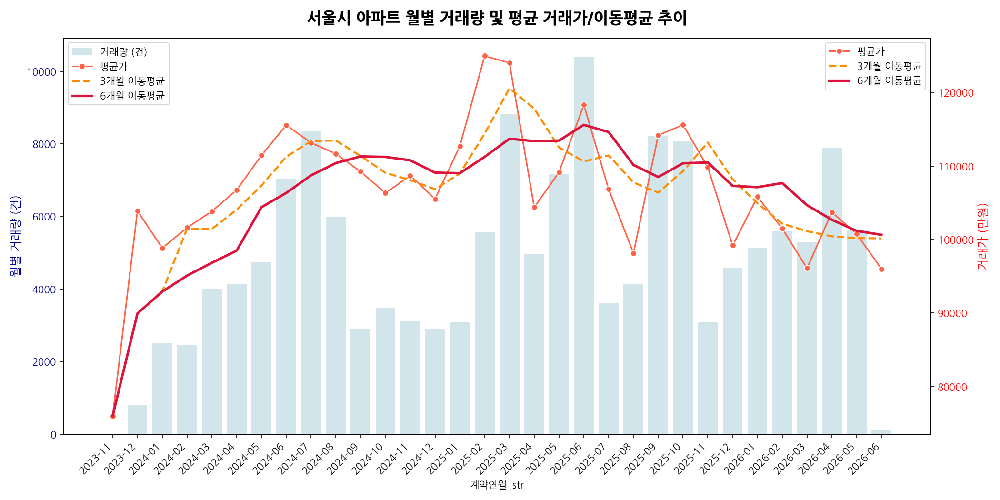
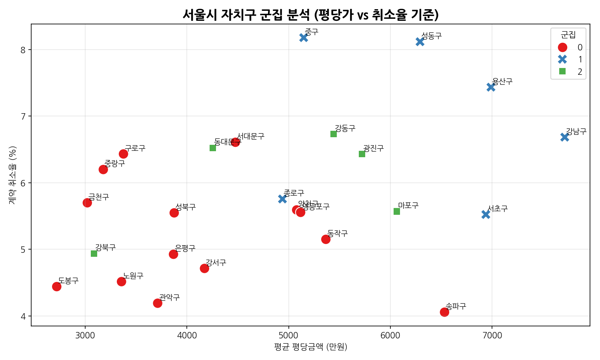
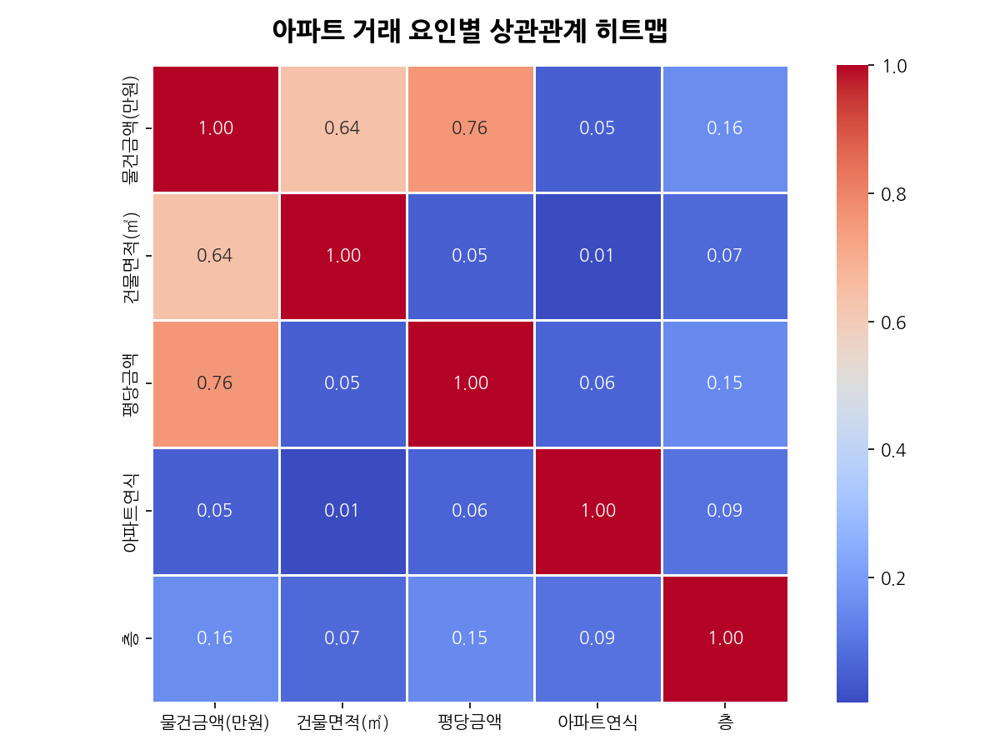
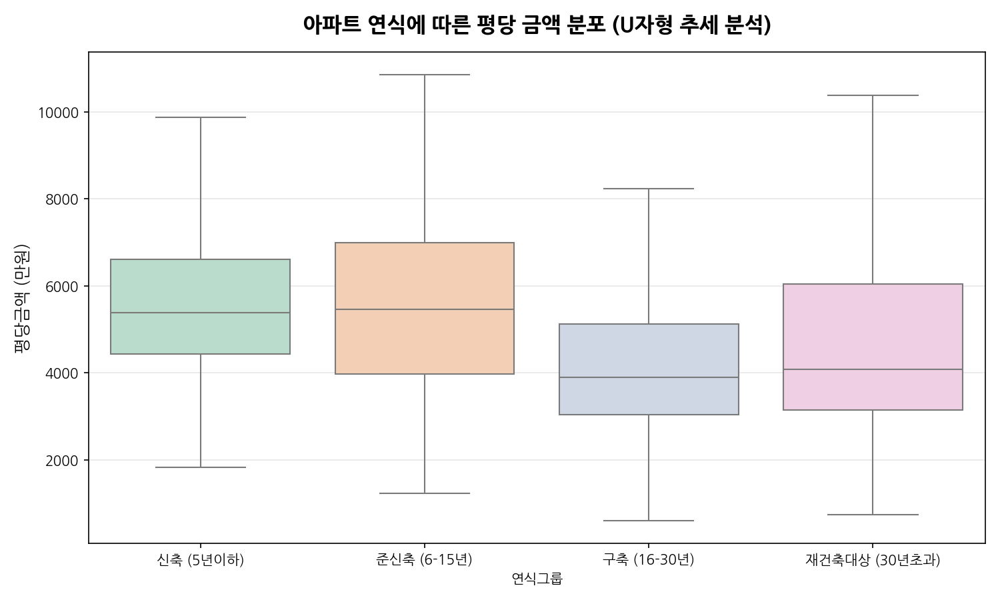
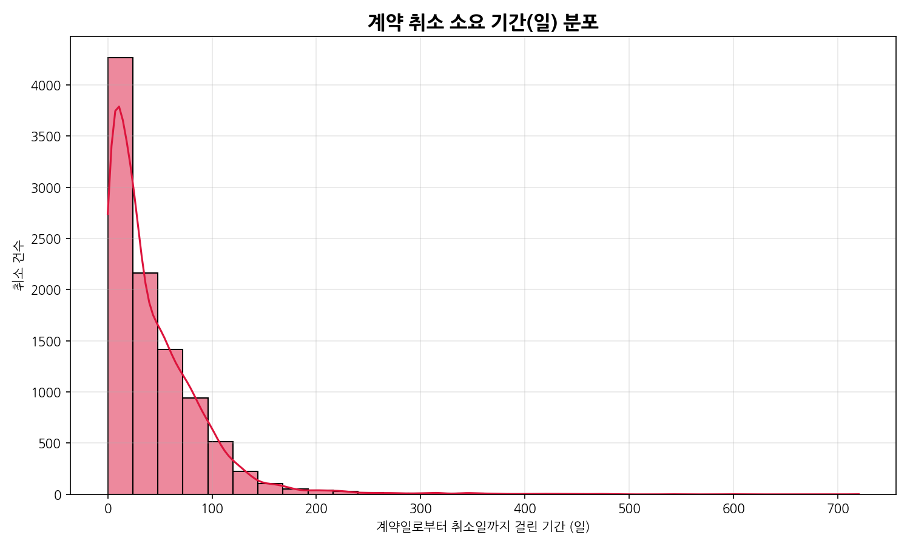

> 서울시 아파트 실거래가 데이터를 바탕으로 결측치 정제, 시계열 트렌드 분석, 자치구별 군집 분석, 상관관계 분석 및 계약 취소 현황을 다각도로 분석하여 부동산 시장의 특성을 도출합니다.

---

## 📌 주요 통계 지표 요약

서울시 부동산 실거래가 데이터셋에서 추출한 핵심 요약 지표는 다음과 같습니다. (이상치 정제 및 이상치 처리 전후 비교 포함)

| 지표명 | 수치 및 분석 내용 |
| :--- | :--- |
| **전체 거래 건수** | 172,451 건 |
| **유효 거래 건수 (취소 제외)** | 162,626 건 |
| **정제 후 거래 건수 (이상치 제외)** | 153,762 건 |
| **계약 취소 건수** | 9,825 건 (평균 취소율: **5.70%**) |
| **평균 거래 가격** | 약 **10억 9,666만 원** |
| **거래 가격 중앙값** | **9억 5,000만 원** |
| **평당 금액 최고 자치구** | **강남구** (평균 평당 약 **7,714만 원**) |
| **평균 취소 소요 기간** | **43.38일** (중앙값: 28.0일) |
| **단기 취소 건수 (3일 이내)** | 1,056 건 |
| **장기 취소 건수 (60일 이상)** | 2,614 건 |

---

## 📊 상세 분석 및 시각화 결과

### 1. 월별 거래량 및 평균 가격 추이 (이동평균)

* **분석 내용**: 월별 거래량(막대그래프, 좌측 축)과 평균 거래가(선그래프, 우측 축)를 이중 축으로 구성하고, 단기(3개월) 및 장기(6개월) 이동평균을 반영하여 부동산 시장의 가격 흐름을 한눈에 볼 수 있도록 하였습니다. 
* **시각화 자료**:

* **인사이트**: 시계열 분석을 통해 거래량의 증감과 가격 변동 간의 연관성을 파악할 수 있으며, 이동평균선을 적용하여 단기 변동에 왜곡되지 않는 장기 추세를 확인할 수 있습니다.

---

### 2. 자치구별 군집 분석 (K-Means)

* **분석 내용**: 자치구별 평균 평당가, 총 거래량, 평균 연식, 계약 취소율 등의 특징(Features)을 활용하여 자치구들을 군집화(K-Means, K=3)했습니다. 
* **시각화 자료**:

* **인사이트**: 
  - 평당가가 유독 높은 하이엔드 지역군(강남3구 등), 거래 활성도와 취소율이 균형을 이루는 주거 지역군, 구축 비율이 높은 대단지 위주 군집 등으로 그룹핑되어 각 자치구의 부동산 성향을 명확히 대조해 볼 수 있습니다.

---

### 3. 아파트 거래 요인 간 상관관계 분석

* **분석 내용**: 거래 가격, 건물 면적, 평당 단가, 아파트 연식, 층 간의 피어슨 상관계수를 히트맵으로 시각화했습니다. 
* **시각화 자료**:

* **인사이트**: 
  - 건물 면적과 거래 가격은 강한 양의 상관관계를 보이며, 아파트 층수 또한 평당 단가와 유의미한 상관성을 보이고 있습니다. 반면 연식은 평당가와 다소 미미한 음의 상관성을 보였으나 이는 아래 연식별 분석에서 보완됩니다.

---

### 4. 아파트 연식에 따른 평당 금액 분포 (U자 추세 검증)

* **분석 내용**: 아파트 연식에 따른 가격 추이를 '신축 (5년 이하)', '준신축 (6-15년)', '구축 (16-30년)', '재건축대상 (30년 초과)'으로 세분화하여 박스플롯(Box Plot)으로 비교했습니다.
* **시각화 자료**:

* **인사이트**: 
  - 신축 선호에 따른 고단가 현상과 30년 초과 시 재건축 기대감으로 인해 평당 단가가 다시 상승하는 부동산 시장 특유의 **'U자 패턴'**이 데이터상으로 시각적으로 명백히 입증되었습니다.

---

### 5. 계약 취소 소요 기간 분포

* **분석 내용**: 부동산 실거래 계약 신고 후 취소되기까지 걸린 소요 기간의 분포를 파악하였습니다. 
* **시각화 자료**:

* **인사이트**: 
  - 3일 이내에 이루어지는 단순 변심 등의 단기 취소(1,056건) 대비, 60일 이상 장기간 경과 후 취소되는 장기 취소(2,614건) 비율이 높게 나타납니다. 이는 일부 자전거래 의심 혹은 등기 지연에 따른 취소 패턴을 추적하는 데 기초 데이터로 쓰일 수 있습니다.

---

## 🚀 인사이트 및 결론

1. **재건축 기대감 반영 (U자 추세)**
   * 준신축에서 구축으로 갈수록 노후화로 인해 평당 가격이 하락하는 경향을 보이지만, 연식이 30년을 초과하여 재건축 요건을 충족하면 기대 심리로 인해 가격이 다시 급격하게 상승하는 흐름이 관측됩니다.
2. **지역적 양극화 뚜렷**
   * 자치구별 평당가 순위와 군집 분석에서 강남구를 필두로 한 강남 3구 그룹이 가격 지표와 취소율 등 전반적인 변수 패턴에서 타 자치구와 명확하게 구분되는 높은 가격대를 점유하고 있음이 시각화와 지도상에 뚜렷이 드러납니다.
3. **실거래 취소 현황 추이**
   * 거래 취소율은 평균 5.70%로 확인되었으며, 특히 취소 소요 기간의 중앙값이 28일로 상당히 지연된 취소 건이 많은 점은 실거래 등록 이후 시장 왜곡 행위의 모니터링 필요성을 방증합니다.

---

## 🛠️ 분석 환경 및 라이브러리
* **Language**: Python 3.13
* **Libraries**: `pandas`, `numpy`, `matplotlib`, `seaborn`, `koreanize-matplotlib`, `scikit-learn`
